<p align="center">
  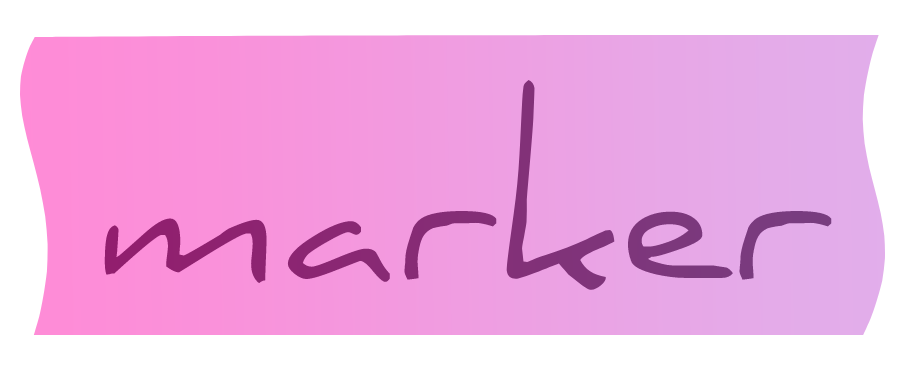
</p>
<p align="center">
       <b>Marker is the easiest way to match and mark strings for colorful terminal outputs.</b>
</p>

<p align="center">
  <a href="https://github.com/cyucelen/marker/actions/workflows/go.yml">
    
  </a>
  <a href="https://codecov.io/gh/cyucelen/marker">
    
  </a>
  <a href="https://goreportcard.com/report/github.com/cyucelen/marker">
    
  </a>
  <a href="https://github.com/cyucelen/marker/blob/master/LICENSE">
    
  </a>
  <a href="https://discord.gg/kaUtncA">
    
  </a>
</p>

# marker

<p align="center">
  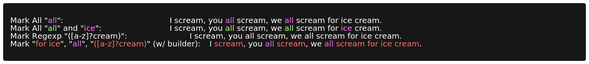
</p>

Marker is built for easily match and mark strings for colorful terminal outputs. You can match your strings with built-in matchers or easily implement a custom matcher for your usecase. Marker uses [fatih/color](https://github.com/fatih/color)
for colorizing terminal output.

## Installation

`go get github.com/cyucelen/marker`

## Basic Usage

Marker has very simple and extensible way to get your strings colorful and brilliant!

### Example

```go
aristotleQuote := "The more you know, the more you realize you don't know."
emphasized := marker.Mark(aristotleQuote, marker.MatchAll("know"), color.New(color.FgRed))
fmt.Println(emphasized)
```

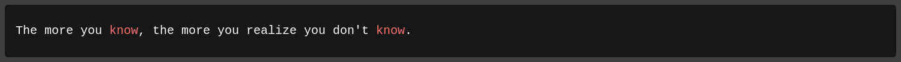

## Table of Contents

- [Mark Your Log Stream](#mark-your-log-stream)
- [Custom `io.Writer` out for log interface](#custom-iowriter-out-for-log-interface)
- [Matchers](#matchers)
  - [MatchAll](#matchall)
  - [MatchN](#matchn)
  - [MatchRegexp](#matchregexp)
  - [MatchSurrounded](#matchsurrounded)
  - [MatchBracketSurrounded](#matchbracketsurrounded)
  - [MatchParensSurrounded](#matchparenssurrounded)
  - [MatchTimestamp](#matchtimestamp)
  - [Builder way](#builder-way)
  - [Writing your custom Matcher](#writing-your-custom-matcher)
- [Contribution](#contribution)

---

## Mark Your Log Stream

You may want to instrument a logger such that any output coming from it is colorized in the expected manner. `marker` contains functionality which can be easily integrated with Golang's `log` or any interface that supports `io.Writer`.

```go
stdoutMarker := marker.NewStdoutMarker()
markRules := []marker.MarkRule{
  {marker.MatchBracketSurrounded(), color.New(color.FgBlue)},
  {marker.MatchAll("marker"), color.New(color.FgRed)},
}

stdoutMarker.AddRules(markRules)
logger := log.New(stdoutMarker, "", 0)

logger.Println("[INFO] marker is working as expected")
```

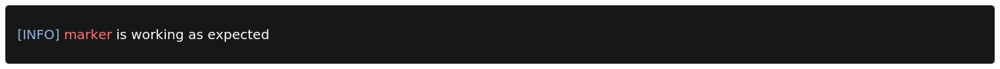

### Custom `io.Writer` out for log interface

`marker` also allows you to specify the `io.Writer` that you want to send output to. This is useful if the logger is writing to somewhere other than `stdout` like a file.

```go
f, _ := os.Create("/tmp/awesome.log")
w := bufio.NewWriter(f)

writeMarker := marker.NewWriteMarker(w)

markRules := []marker.MarkRule{
  {marker.MatchBracketSurrounded(), blueFg},
  {marker.MatchAll("marker"), magentaFg},
}

writeMarker.AddRules(markRules)

logger := log.New(writeMarker, "", 0)
logger.Println("[INFO] colorful logs even in files, marker to mark them all!")

w.Flush()
f.Close()

output := catFile("/tmp/awesome.log") // $ cat /tmp/awesome.log
fmt.Print(output)
```

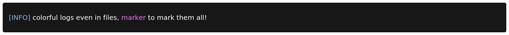

---

## Matchers

#### MatchAll

```go
aristotleQuote := "The more you know, the more you realize you don't know."
emphasized := marker.Mark(aristotleQuote, marker.MatchAll("know"), color.New(color.FgRed))
fmt.Println(emphasized)
```


#### MatchN

```go
boringLog := "[INFO] Nobody wants to read pale [INFO] tags."
brilliantLog := marker.Mark(boringLog, marker.MatchN("[INFO]", 1), color.New(color.FgBlue))
fmt.Println(brilliantLog)
```

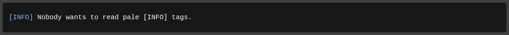

#### MatchRegexp

```go
rhyme := "I scream, you all scream, we all scream for ice cream."
r, _ := regexp.Compile("([a-z]?cream)")
careAboutCream := marker.Mark(rhyme, marker.MatchRegexp(r), color.New(color.FgYellow))
fmt.Println(careAboutCream)
```

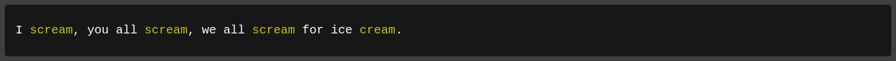

#### MatchSurrounded

```go
sentence := "I pull out things surrounded by abcWHOA COLORSdef"
markedSurrounded := marker.Mark(sentence, marker.MatchSurrounded("abc", "def"), color.New(color.FgMagenta))
fmt.Println(markedSurrounded)
```

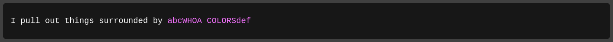

#### MatchBracketSurrounded

```go
sentence = "[INFO] This is what log lines look like"
markedSurrounded = marker.Mark(sentence, marker.MatchBracketSurrounded(), color.New(color.FgRed))
fmt.Println(markedSurrounded)
```

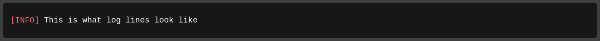

#### MatchParensSurrounded

```go
sentence = "[ERROR] This is what (parens) lines look like"
markedSurrounded = marker.Mark(sentence, marker.MatchParensSurrounded(), color.New(color.FgBlue))
fmt.Println(markedSurrounded)
```

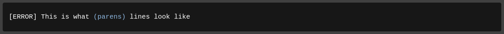

#### MatchTimestamp

`MatchTimestamp` can be used for matching the timestamps fits the layouts in Golang's `time`.

All possible formats can be found [here](https://github.com/golang/go/blob/8de0bb77ebc3408a586ad96a3c9ae9c231fd15a3/src/time/format.go#L73).

```go
  goodOldTimes := "2006-01-02T15:04:05Z07:00 [INFO] Loading King of Fighters '97 ROM"
  timestampMarked := marker.Mark(goodOldTimes, marker.MatchTimestamp(time.RFC3339), color.New(color.FgBlue))
  fmt.Println(timestampMarked)
```

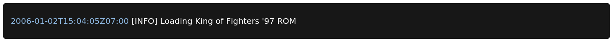

---

## Builder way

If you want to mark different patterns in the same string, marker builder is neater way to do this.

```go
rhyme := "I scream, you all scream, we all scream for ice cream."
b := &marker.MarkBuilder{}
r, _ := regexp.Compile("([a-z]?cream)")

markedWithBuilder := b.SetString(rhyme).
  Mark(marker.MatchN("for ice", 1), color.New(color.FgRed)).
  Mark(marker.MatchAll("all"), color.New(color.FgMagenta)).
  Mark(marker.MatchRegexp(r), color.New(color.FgYellow)).
  Build()

fmt.Println(markedWithBuilder)
```

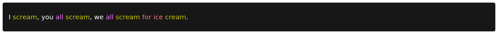

---

## Writing your custom `Matcher`

As you see in above examples, **Mark** function takes an **MatcherFunc** to match the patterns in given string and colorize them.
A **Matcher** is a simple closure that returns a **MatcherFunc** to be called by **Mark** function to get **Match** information to put colorized versions of patterns into template.

Lets write our own custom Matcher that matches first encounter of given pattern.

### Example

```go

  func MatchFirst(pattern string) marker.MatcherFunc {
    return func(str string) marker.Match {
      return marker.Match{
        // replace first matching pattern with %s
        Template: strings.Replace(str, pattern, "%s", 1),
        // patterns to be colorized by Mark, in order
        Patterns: []string{pattern},
      }
    }
  }
```

You can also check built-in [matchers](https://github.com/cyucelen/marker/blob/master/matcher.go) for inspiration.

# Contribution

I would like to accept any contributions to make Marker better and feature rich. So feel free to contribute your features(i.e. more **Matcher**s!), improvements and fixes.

## Have fun!
