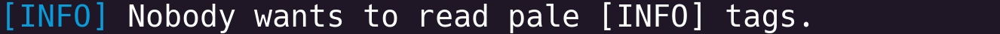
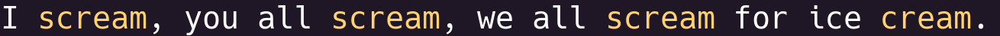
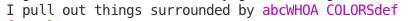
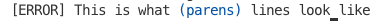
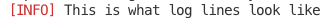
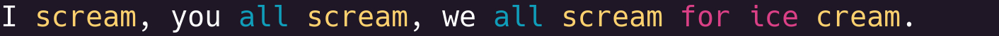

<p align="center">
  
</p>
<p align="center">
       <b>Marker is the easiest way to match and mark strings for colorful terminal outputs.</b>
</p>

<p align="center">
  <a href="https://travis-ci.org/cyucelen/marker">
    
  </a>
  <a href="https://codecov.io/gh/cyucelen/marker">
    
  </a>
  <a href="https://goreportcard.com/report/github.com/cyucelen/marker">
    
  </a>
  <a href="https://github.com/cyucelen/marker/blob/master/LICENSE">
    
  </a>
  <a href="http://spacemacs.org">
    
  </a>
</p>

# marker

<p align="center">
  
</p>

Marker is built for easily match and mark strings for colorful terminal outputs. You can match your strings with built-in matchers or easily implement a custom matcher for your usecase. Marker uses [fatih/color](https://github.com/fatih/color) 
for colorizing terminal output.

## Installation

`go get github.com/cyucelen/marker`

## Basic Usage

Marker has very simple and extensible way to get your strings colorful and brilliant!

## Matchers

#### MatchAll
```go
  aristotleQuote := "The more you know, the more you realize you don't know."
  emphasized := marker.Mark(aristotleQuote, marker.MatchAll("know"), color.New(color.FgRed))
  fmt.Println(emphasized)
```


#### MatchN
```go
  boringLog := "[INFO] Nobody wants to read pale [INFO] tags."
  brilliantLog := marker.Mark(boringLog, marker.MatchN("[INFO]", 1), color.New(color.FgBlue))
  fmt.Println(brilliantLog)
```


#### MatchRegexp

```go
  rhyme := "I scream, you all scream, we all scream for ice cream."
  r, _ := regexp.Compile("([a-z]?cream)")
  careAboutCream := marker.Mark(rhyme, marker.MatchRegexp(r), color.New(color.FgYellow))
  fmt.Println(careAboutCream)
```


---

#### MatchSurrounded

Example 1:

```go
	sentence := "I pull out things surrounded by abcWHOA COLORSdef"
	markedSurrounded := marker.Mark(sentence, marker.MatchSurrounded("abc", "def"), magentaFg)
	fmt.Println(markedSurrounded)
```


Example 2:

```go
	sentence = "[ERROR] This is what (parens) lines look like"
	markedSurrounded = marker.Mark(sentence, marker.MatchParensSurrounded(), blueFg)
	fmt.Println(markedSurrounded)
```


Example 3:

```go
	sentence = "[INFO] This is what log lines look like"
	markedSurrounded = marker.Mark(sentence, marker.MatchBracketSurrounded(), redFg)
	fmt.Println(markedSurrounded)
```

---

## Builder way

If you want to mark different patterns in the same string, marker builder is neater way to do this.

```go
  rhyme := "I scream, you all scream, we all scream for ice cream."
  b := &marker.MarkBuilder{}
  r, _ := regexp.Compile("([a-z]?cream)")

  markedWithBuilder := b.SetString(rhyme).
    Mark(marker.MatchN("for ice", 1), color.New(color.FgRed)).
    Mark(marker.MatchAll("all"), color.New(color.FgMagenta)).
    Mark(marker.MatchRegexp(r), color.New(color.FgYellow)).
    Build()

  fmt.Println(markedWithBuilder)
```


---

## Writing your custom Matcher

As you see in above examples, **Mark** function takes an **MatcherFunc** to match the patterns in given string and colorize them. 
A **Matcher** is a simple closure that returns a **MatcherFunc** to be called by **Mark** function to get **Match** information to put colorized versions of patterns into template.

Lets write our own custom Matcher that matches first encounter of given pattern.
### Example
```go

  func MatchFirst(pattern string) marker.MatcherFunc {
    return func(str string) marker.Match {
      return marker.Match{
        // replace first matching pattern with %s
        Template: strings.Replace(str, pattern, "%s", 1),
        // patterns to be colorized by Mark, in order 
        Patterns: []string{pattern},
      }
    }
  }
```

You can also check built-in [markers](https://github.com/cyucelen/marker/blob/master/marker.go) for inspiration.

# Contribution

I would like to accept any contributions to make Marker better and feature rich. So feel free to contribute your features(i.e. more **Matcher**s!), improvements and fixes. 

## Have fun!
